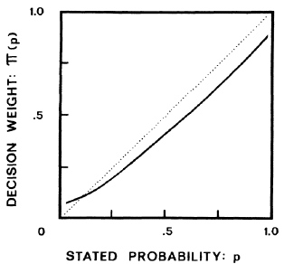
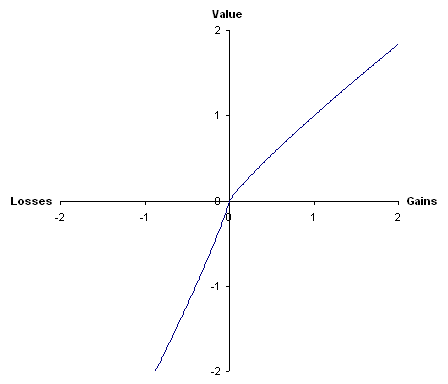

# 14. Overview of descriptive decision theory

This chapter gives an overview of how people *actually* make decisions. People frequently act in ways deemed irrational by decision theorists. Either people should behave differently, or there's something wrong with the normative theories discussed in the preceding chapters of this book.

It wasn't until 1979 and the publication of a famous paper by Kahneman and Tversky that it finally became widely accepted that expected utility theory is a false descriptive hypothesis. In this chapter we summarize their findings.

## 14.1. Observed violations of the expected utility principle

They asked a group of 72 students to state a preference between A and B. 82% of them preferred B to A.

* A:
    - $2.5k with probability 0.33
    - $2.4k with probability 0.66
    - $0 with probability 0.01
* B:
    - $2.4 with certainty

The expected monetary value of A is slightly higher than B, but that doesn't mean the students were irrational. Then they asked the same gropu to state another preference:

* C:
    - $2.5k with probability 0.33
    - $0 with probability 0.67
* D:
    - $2.4k with probability 0.34
    - $0 with probability 0.66

83% of participants preferred C (ane: D). A large majority preferred B to A, but C to D. But this is incompatible with the independence axiom, and also with the expected utility principle (chapter 5). This experiment is a version of Allais' paradox.

| | Ticket 1-33 | Ticket 34-99 | Ticket 100 |
| - | - | - | - |
| A | $2.4k | $2.4k | $2.4k |
| B | $2.5k | $2.4k | $0 |
| C | $2.4k | $0 | $2.4k |
| D | $2.5k | $0 | $0 |

Since the only difference between the 2 pairs of lotteries is the addition of a 66% chance of winning $2.4k in A and B, A should be preferred to B iff C is preferred to D, no matter what the dm's utility for money is (section 4.4).

They observed that it makes a difference whether respondents are presented with 'positive' or 'negative' prospects, even if the end states are the same.

## 14.2. Prospect theory

This is a descriptive theory of choice under risk. This theory holds that the expected utility principle should be modified by introducing two weighting functions, one for value and one for probability. While the expected probability of a risky prospect is p1 * u1 + ... + pn * un, its *prospect value* is given by the following expression: w(p1) * v(u1) + ... + w(pn) + v(un)

The w function accounts for the observation that people tend to overestimate small probabilities, but underestimate moderate and large probabilities. The exact shape of w is an empirical issue, the authors propose that it might look like the bold line.

The shape of the weighting function for values v is more complex. They argue that in all decisions under risk, individual first determine a baseline, and thereafter evaluate outcomes either as gains or losses, like a S-shaped function.

## 14.3. Violations of transitivity and completeness

Several researches have also reported violations of other fundamental principles of rational choice, not just expected utility principle. May observed that a large number of college students stated cyclic and thus nontransitive preferences. It seems to be a descriptive fact that a significant number of ordinary people fail to satisfy the transitivity axiom.

## 14.4. The relevance of descriptive decision theory

When confronted with empirical studies of how people actually do behave, most decision theorists swiftly conclude that people are irrational. This relies heavily on the premise that our normative theories are correct, or at least can't be falsified by empirical findings. Nearly all philosophers accept Hume's law, which holds that no normative conclusion can be derived from purely factual premises. To determine what rational people *ought* to do, it's not sufficient to present purely factual evidence about how people do *actually* behave.

