# [Intro to causal inference notes](http://www.causalcourse.com)

* [Textbook for the course (pdf)](https://www.bradyneal.com/Introduction_to_Causal_Inference-Sep13_2020-Neal.pdf)
    - Changes regularly, check www.causalcourse.com for the latest update
* [Code for the textbook](https://github.com/bradyneal/causal-book-code)

## Table of contents

1. [Introduction](#1-introduction)
    1. Simpson's paradox: causal graphs
    2. Correlation does not imply causation: confounding
    3. What implies causation? potential outcomes and ATE
    4. Observational studies
2. [Potential outcomes](#2-potential-outcomes)
    1. Assumptions for identifiability
        1. Ignorability / exchangeability
        2. Conditional exchangeability / unconfoundedness
        3. Positivity
        4. No interference
        5. Consistency
    2. The adjustment formula
    3. Statistics terminology explanation
    4. A complete example with estimation
3. [Causal graphs](#3-causal-graphs)
    1. Bayesian networks and causal graphs
    2. Basic building blocks of graphs
4. [Causal models](#4-causal-models)
    1. Do operator
    2. Modularity assumption
    3. Backdoor adjustment
    4. Structural causa models
5. [Randomized experiments and identification](#5-randomized-experiments-and-identification)
    1. Randomized experiments
    2. Frontdoor adjustment
    3. Pear's do-calculus
    4. Determining identifiability from a graph
6. [Estimation](#6-estimation)
    1. Conditional outcome modeling
    2. Increasing data efficiency
    3. Propensity scores and IPW
    4. Other methods
7. [Unobserved confounding](#7-unobserved-confounding)
    1. Bounds
        1. No-assumptions bound
        2. Monotone treatment response
        3. Monotone treatment selection
        4. Optimal treatment selection
    2. Sensitivity analysis
        1. Linear single confounder
        2. Towards more gneral settings

--------------------------------------

## 1 Introduction

The goal of causal inference is to infer the effect of a treatment/policy on some outcome.

### 1.1. Simpson's paradox

Faced with a new disease and trying to minimize death, there are 2 treatments (T). A common one (A), and a scarce one (B). Patients can have a mild (0) or severe (1) condition (C). In the outcome (Y), the patient can either live (0) or die (1).

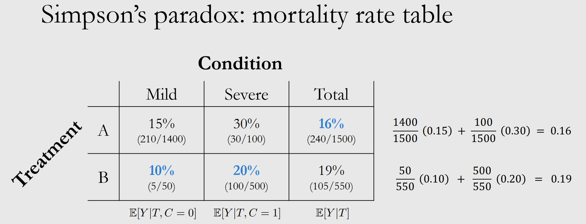

**Simpson's paradox**: looking at just the total numbers, it seems like A is doing better than B, but looking at each specific condition, at mild and severe B does better. The paradox comes from unequal weighting: the total for T=A is heavily weighted by the mild cases, because there are so many more than severe cases. In T=B, the severe group has a much bigger weight.

> Which treatment do we choose? Depends on the causal structure of the problem.

Let us consider two scenarios: in scenario 1, **the condition is a cause of the treatment**, and both are a cause of the outcome. That means, the treatment is chosen based on condition, and outcome is determined by both the condition and the treatment.

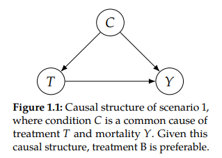

If a patient has C=0, they get T=A because doctors save the scarce treatment (B) for the severe cases. If a patient has C=1, they get T=B. Looking at the mortality rate table, most people with C=0 get T=A, and most people with C=1 get T=B.

**Condition confounds the effect of treatment on mortality**. To correct for this, we have to examine the relationship of T and Y among patients with the same condition. The better treatment is the one yielding lower mortality in each condition: treatment B.

----------------------------------------

In scenario 2, **treatment is a cause of condition**, and both are a cause of the outcome.

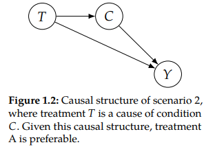

If a patient gets T=B, they might wait a long time to take it because it is scarce, and the condition worsens to C=1. That is why among people with T=B, most of them have C=1, because they get sicker and transition from C=0 to C=1. With T=A, the patient gets it very fast and they remain in C=0. In this scenario, **T=A is preferred**.

### 1.2. Correlation does not imply causation

The course will use the term *association* to refer to statistical dependence. Causation is not all or none. For any given amount of association, some degree can be causal. The phrase "association is not causation" simply means that the amount of association and the amount of causation can be different.

> Sleeping with shoes on is strongly correlated with waking up with a headache. But both sleeping with shoes on and headache can be explained by a common cause: drinking the night before (this is called a confounder)

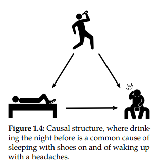

Causal association states that the headache is caused by sleeping with shoes. The confounding association says that drinking affects both sleeping with shoes, and waking up with a headache. The association between shoes and headache is facilitated by the confounder. Total association (e.g. correlation) is the mixture of causal and confounding association. Both variables affect the outcome. This additional confounding association is why correlation does not imply causation.

We cannot properly estimate causation because the groups for both treatments are not comparable. Most people who sleep with their shoes on has been drinking, and most people sleeping without shoes has not been drinking.

### 1.3. Then, what does imply causation?

Given a headache, you can take a pill (T=1) or not (T=0). Each produces a different outcome: Yi(T=1) for no headache and Yi(T=0) for headache. *i* is used for one specific individual. The outcome is completely dependent on whether the patient takes the pill or not. The **causal effect** of taking the pill given a headache is the difference between the two potential outcomes, Yi(1) - Yi(0).

> A potential outcome Y(t) is different from the observed outcome Y in that not all potential outcomes are observed. All potential outcomes can potentially be observed.

*The fundamental problem of causal inference* is that once an action is taken (factual), you can't observe the the other action (counterfactual), and cannot compute the causal effect. You cannot observe the individual treatment effect (ITE). Which is why potential outcomes are used to obtain the causal effect. By taking many people, Y(t) becomes random and we can obtain the average treatment effect (ATE), taking the average over *i*: E[Y(1)] and E[Y(0)], and obtain the causal effect.

In the specific example of the headache and the pill, the difference between potential outcomes (ATE) is equal to the difference in conditional expectations: E[Y(1)] - E[Y(0)], which is a causal quantity obtained from the causal association between treatment and outcome. And in this example, the only conditional to the outcome is the treatment. Therefore, Y(1) = Y(T=1).

In general, because of the confounding association, E[Y(1)] - E[Y(0)] does not equal E[Y|T=1] - E[Y|T=0], because this is a mixture of confounding association and causal association, which is not causal since the condition has a confounding effect.

To obtain causation, we need to make groups comparable, we need to bypass the effect of condition in the treatment. **Randomized control trials (RCT)** randomly distribute the subjects into treatment group or control group, ensuring that condition cannot be a cause of the treatment. In RCT, the 'drunk people' are evenly distributed among the two groups. If the distribution of the outcome varies by levels of the assigned intervention, we say that A has a causal effect on Y.

### 1.4. Observational studies

Sometimes it is not possible to randomize treatment in real-life scenarios. Some possible reasons:

* Ethical reasons (cannot randomize people to smoke to measure effect on lung cancer)
* Infeasability (cannot randomize countries into communist/capitalist systems to measure effect on GDP)
* Impossibility (cannot change a living person's DNA at birth to measure effect on breast cancer)

> How to measure causal effects in observational studies?

We can isolate the causal association by adjusting or controlling for confounders. When you control for the right variable W, and W is a sufficient adjustment set, the confounding association is blocked.

In the disease example, we adjust for the only available variable, condition. We can obtain E[Y(t)] = E[Y|do(T=t)] = ECE[Y|t, C] by averaging over C

> Application to the disease example from the beginning

Assuming the scenario 1, where condition is a cause for treatment, we marginalize over C (the only variable). Since C is discrete, we can take a sum over C and calculate the probabilities for each condition.

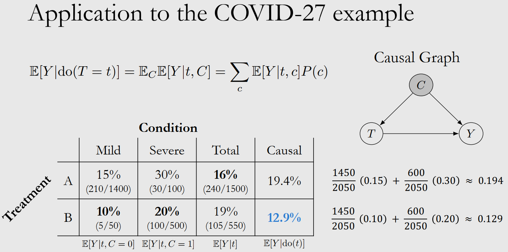

In the naive example (see first picture), the probability of the condition is wrong, because condition is a cause of treatment and it has not been taken into consideration. It only depends on the people taking the specific treatment. In this case, the probability of condition being mild equals all the people with this condition, divided by all the people in total. This probability looks *across* all treatments, across the whole dataset.

## 2 Potential outcomes

We can imagine a dataset with some individuals, where each one take one action and see a specific outcome. The counterfactual is not observed and we cannot calculate their individual ITE. In the naïve case, we can look at all individuals with treatment 1 (take the pill) and get the average. Same for treatment 0, and obtain the difference. This is the calculation of E[Y|T=1] - E[Y|T=0]. But this is an associational difference, not the ATE. We cannot do ATE because the groups of people choosing T=0 and T=1 are not comparable. The outcome of each group is determined by the condition of the group, the effects of the treatment and the condition are mixed together. If the condition (drunkenness, previous diseases etc.) was equally distributed, then we can use E[Y|T=1] - E[Y|T=0] to calculate the ATE.

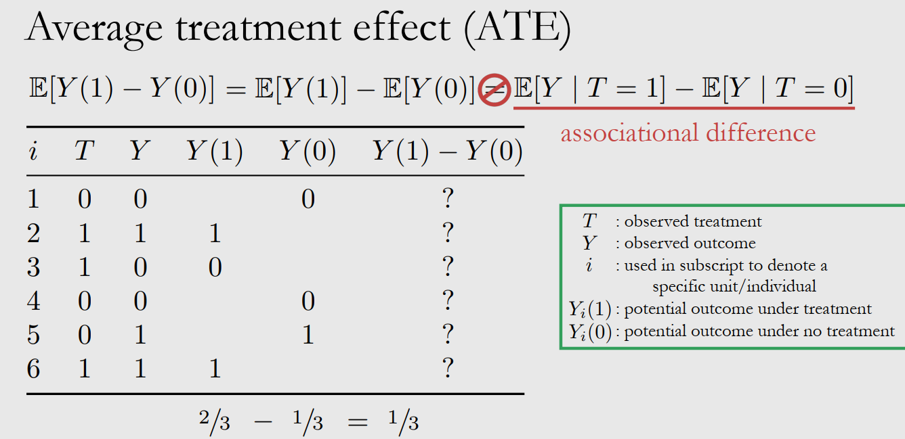

What assumptions make the ATE equal to the associational difference?

### 2.1. Assumptions

> Ignorability / exchangeability

**Ignorability** says that the treatment assignment mechanism is ignorable, we can ignore the missing data, we can skip the question marks in the data under Y(1) and Y(0) in the image above. The outcomes of both treatments are independent of the treatment. There is no confounding, the covariates are not a cause of the treatment.

Another perspective to the same concept is **exchangeability**. The group A takes treatment 1, and have a certain expected outcome and vice versa for group B. Exchangeability means that if the groups are swapped, the expected values remain the same. And E[Y(1)|T=1] = E[Y(1)|T=0] = E[Y(1)]. Which means that the potential outcome Y(1) is independent of treatment. And same for Y(0). Both groups are comparable.

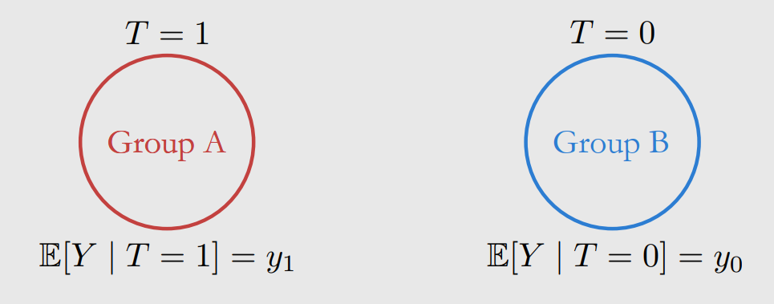

Making this assumption, we can reduce the ATE to the associational difference. E[Y(1) - Y(0)] = E[Y|T=1] - E[Y|T=0]. But it is not a very realistic assumption, because there is almost always confounding in the data. But this assumption can be done by running randomzed experiments.

> Conditional exchangeability / unconfoundedness

Usually the treatment groups are not exchangeable. But if we control for relevant variables by conditioning, then the groups can be exchangeable. The idea is that although the treatment and potential outcomes can be affected by confounding, within levels of X, they are not associated. Because exchangeability is not realistic, conditional exchangeability is used.

Exchangeability means that the outcome is independent with regards to the treatment. The confounding aspect X has no effect on T. **Conditional exchangeability/unconfoundedness** means that the outcome is independent with regards to the treatment, conditioned on X. Confounding exists, but it is blocked. This is an untestable assumption: we might have a conditional exchangeability conditioned on X, but if there is another confounder W, this is no longer true. We never know if there are more confounders.

The conditional ATE is E[Y(1) - Y(0) | X], which assuming the conditional exchangeability, we can turn into E[Y|T=1, X] - E[Y|T=0, X]. To obtain the normal ATE from this, we use the adjustment formula and we marginalize over X.

> Positivity

Can we simply condition on many covariates to achieve unconfoundedness? No, because it violates positivity, there is a tradeoff betweeen unconfoundedness and positivity.

**Positivity** says that for all values of covariates present in the population (anything with probability > 0), the probability of treatment is > 0 and < 1 for all values of treatment. 0 < P(T=1|X=x) < 1. In the populatoin X=x, if no one is given the treatment we cannot observe the causal effect of the treatment, because no one got it. And same if everyone got the treatment.

Another perspective to positivity is **overlap**. If the population subsets that have received no treatment (P(X|T=0)) and the population that have all received treatment (P(X|T=1)) have no overlap at all, there is a severe positivity violation. If they overlap, there is no violation among the covariates where there's overlap but in the covariates with no overlap, there is severe positivity violation. If they are completely overlapped, there is no positivity violation. This is the ideal situation for identifiability.

There is a positivity-unconfoundedness tradeoff: the more covariates you condition on, the more likely you are to satisfy unconfoundedness. But the more covariates you condition on, the worse positivity gets. If you want to estimate ATE (= sum_x(E[Y|T=1, X] - E[Y|T=0, X])) when you have a severe positivity violation, no overlap at all, you have to extrapolate because you are missing data. When summing over all x in the first part, there is no one who hasn't received treatment, there is no data to use. And same for the second part.

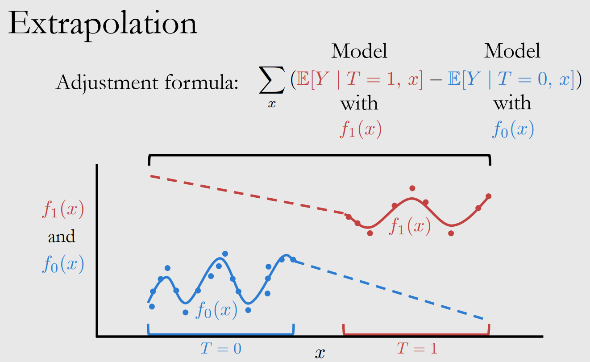

> No interference

Another assumption is **no interference**: it says that an individual's potential outcome is only a function of the individual's own treatment. It doesn't depend on others' outcomes or treatments. Yi(t1, ...,ti, ...,  tn) = Yi(ti)

> Consistency

**Consistency** is the assumption that the observed outcome Y is actually the potential outcome under the observed treatment T.If T=t, then Y=Y(t), where Y is the observed outcome and Y(t) the potential outcome. If I get a specific treatment, then the potential outcome should be the same each time I get that treatment. If it's not, then the potential outcome isn't well defined.

### 2.2. The adjustment formula

**The adjustment formula**: by using these assumptions, the causal quantity can turn into a statistical quantity, going from the ATE to the associational difference, which is available data have since the probabilities of P(x, t, y) are known. A causal quantity (e.g. E[Y(t)]) is **identifiable** if it can be computed from a purely statistical quantity (e.g. E[(Y|t)]).

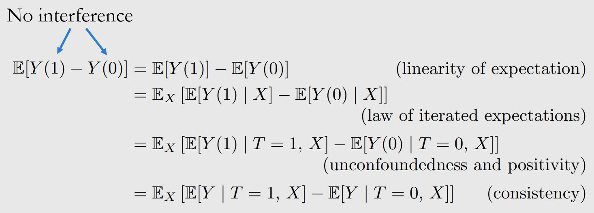

### 2.3. Statistics terminology explanation

* Estimand: any quantity we want to estimate, ATE (causal estimand), statistical estimand
* Estimate: approximation of some estimand using data
* Estimation: process for getting from data and estimand, to estimate

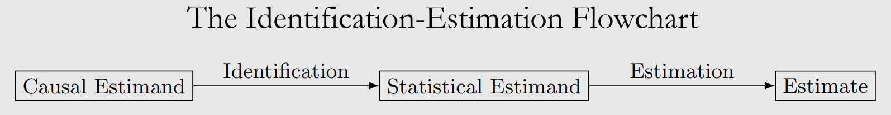

### 2.4. A complete example with estimation

Example of estimation: effect of sodium intake on blood pressure. Treatment is sodium intake (continuous variable, depends on how much), outcome is systolic blood pressure (continuous variable). Covariates X: age and amount of protein excreted in urine. Using the data from [Luque-Fernandez et al. (2018)](https://academic.oup.com/ije/article/48/2/640/5248195), we know that the true ATE is 1.05.

Following the ATE simplification due to assumptions, we can use linear regression to learn E[Y|t, x], The code for this can be found in [Github](https://github.com/bradyneal/causal-book-code/blob/master/sodium_example.py) assuming linear parametric form Y = &alpha;T + &beta;X, to estimate &alpha; and &beta;.

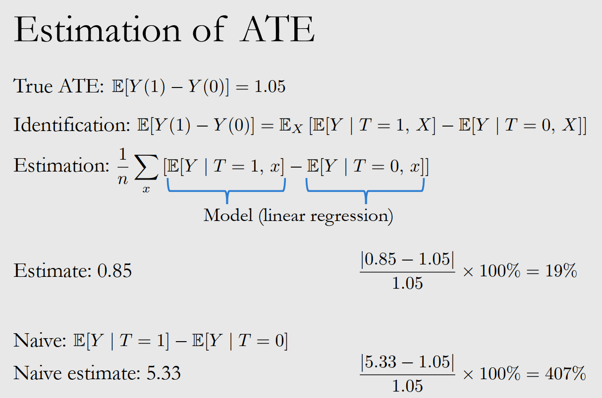

This system has some limitations: assuming a linear parametric form, we assume that the causal effect is the same for all individuals. &beta; might be different. Yi(1) - Yi(0) = &alpha; * 1 + &beta;xi - &alpha; * 0 - &beta;xi = &alpha;

## 3 Causal graphs

This course handles directed acyclic graphs (DAGs). Nodes are connected through edges, paths can be established following these edges. Two nodes are immoral when they are both parents of a common node, but are not connected between them.

### 3.1. Bayesian networks and causa graphs

When obtaining the probability of a joint distribution, P(x1, ..., xn), we can decompose it as a product of P(x1) * P(x2|x1) * P(x3|x1, x2) and so on. Modelling all these parameters requires a lot of computation. But if x4 depends on x3 and on nothing else, P(x4|x1, x2, x3) = P(x4|x3) it becomes much simpler.

> Local Markov assumption

Given its parents in the DAG, a node X is independent of all of its non-descendants. The big product for the probability of the joint distribution can be simplified. With this assumption, each node depends only on its parents --> bayesian network factorization. This assumption refers to statistical independence.

With this assumption, there might be an edge between two nodes, but the nodes can be independent.

> Minimality assumption

This assumes the local Markov assumption, and also that adjacent nodes in the DAG are dependent. Connected nodes are not independent. This assumption refers to statistical dependence.

> Causal edges assumption

A variable X is a **cause** of a variable Y if Y can change in response to changes in X. In a directed graph, every parent is a direct cause of all its children. This refers to causal dependencies. Causation is not symmetric, it only flows in one direction.

### 3.2. Basic building blocks of graphs

Graphical building blocks: chain, fork and immorality.

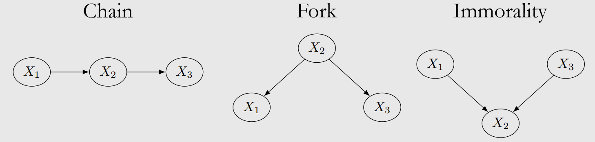

This is how association flows, dependence in chains and forks.

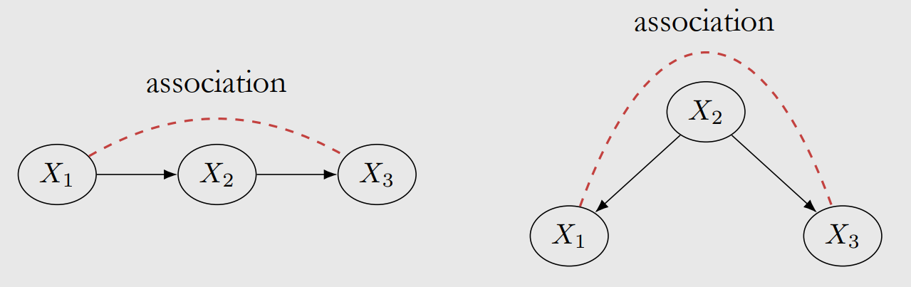

To obtain independence between X1 and X3, we can block the path

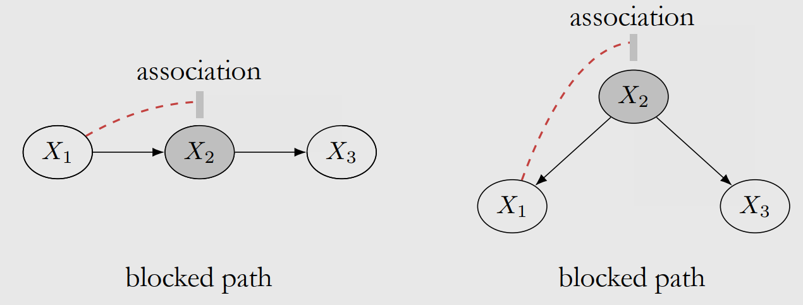

And so to prove conditional independence in chains, we can use these concepts. Equivalent for fork graphs.

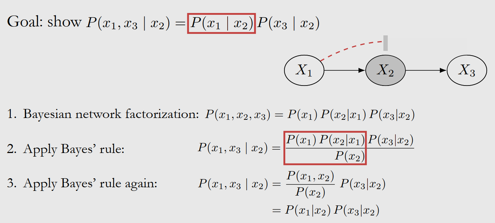

In immoralities, X1 and X3 are not associated. X2 (collider) blocks association even when we're not conditioning on it. P(x1, x3) = P(x1) * P(x3).

If we condition on a collider, it unblocks the path, induces dependence between X1 and X3. Opposite as chains and forks.

> As an example, X1 is good-looking, X3 is kindness, and X2 = X1 & X3 is relationship status. In the general population, there is no association between X1 and X3. But if we condition for X2, if we look only at single people, there is an induced association (selection bias) between looks and kindness.

When a collider is conditioned, it induces association between its parents. If you condition on a descendant of X2, that also induces association between X1 and X3.

### 3.3. The flow of association and causation

A path between nodes X and Y is blocked by a conditioning set Z if either of the following is true:

1. Along the path, there is a chain ... -> W -> ... or a fork ... <- W -> ... where W is in the conditioning set Z.
2. On the path, there is a colider not in the conditioning set Z, and no descendants are in this set either.

> d-separation

Two sets of nodes X and Y are d-separated by a set of nodes Z if all paths between (any node in) X and (any node in) Y are blocked by Z. It implies independence between X and Y.

This is the global Markov assumption, which is equivalent to local Markov assumption. Which is just called Markov assumption.

## 4 Causal models

### The do-operator

When we move from statistical quantities to causal quantities. It makes the distinction between conditioning and intervening.

Conditioning is just restricting the data to a specific subset. But intervening means altering the whole dataset, not just a subset.

* An interventional distribution: P(Y(t)=y) == P(Y=y \| do(T=1)) == P(y \| do(t)).
* ATE: E[Y | do(T=1)] - E[Y | do(T=0)]
* An observational distribution: P(Y, T, X) = P(Y | T=t). No intervention on the treatment

Identification: taking a causal estimand and turning it into a statistical estimand. P(y \| do(t)) --> P(y \| t). We can do this by looking at our causal model. These two things are equal if there is no confounding. If there is, P(y \| t) = EX[P(y \| t, X)].

### Main assumption: modularity

The causal mechanism for a specific variable in the causal graph is P(xi \| pai), all the parents of that variable and all their arrows into that variable.

The **modularity assumption** says that if we intervene on a node X, then only the mechanism P(xi \| pai) changes. All other mechanisms P(xj \| paj) where i!=j remain unchanged. In other words, the causal mechanisms are modular.

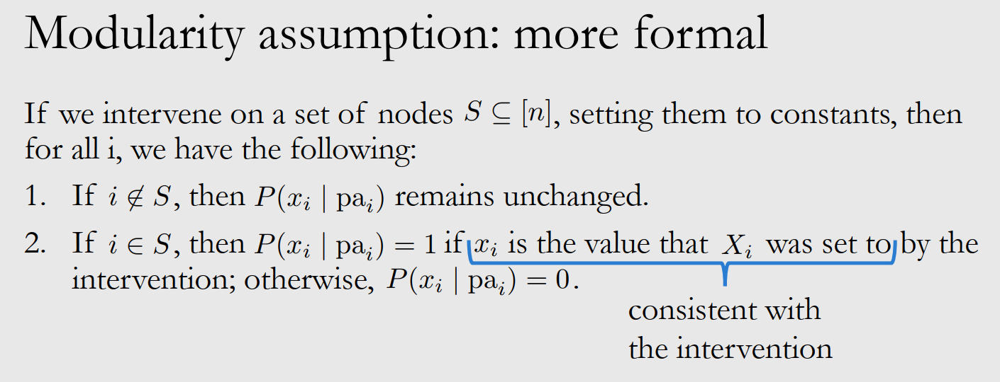

To manipulate a graph, we take the observational data. Pick a variable T, remove its parents. With the modularity assumption, all other factors remain the same so we only manipulate T. With this assumption we can simplify this formula using the **truncated factorization**:

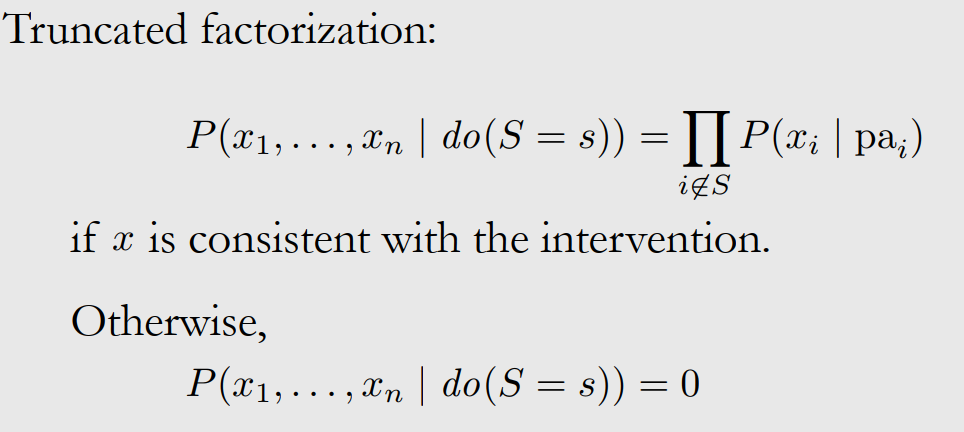

With this, we can identify P(y \| do(t)) faster.

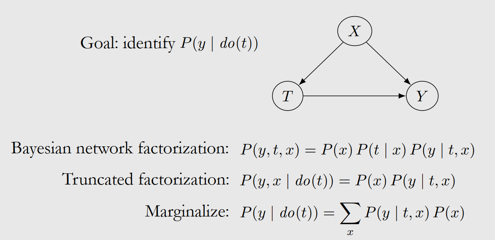

### Backdoor adjustment

This is the most common example of identification: we can identify causal effects via the backdoor adjustment.

By intervening on T, and deleting its parents, we can block backdoor / noncausal paths. A set of variables W satisfies the backdoor criterion relative to T and Y if the following are true:

1. W blocks all backdoor paths from T to Y
2. W does not contain any descendants of T

If W satisfies the backdoor criterion, W is a sufficient adjustment set. W is sufficient to adjust for to get the causal effect of T on Y. Proof on slide 20.

How does this backdoor adjustment relate to the adjustment formula in the potential outcomes chapter? Answer in section 4.4.1 of the ICI book.

### Structural causal models

Structural equation for A as a cause of B: B := f(A, U) where U is some randomness.

If we model the causal mechanism of a variable, this variable is referred to as an *endogenous variable*. And those variables that we do not model how they are caused, and usually have no parents, are *exogenous variables*.

A structural causal model (SCM) is a tuple of the following sets:

1. A set of endogenous variables
2. A set of exogenous variables
3. A set of functions, one to generate each endogenous variable as a function of the other variables

Given an SCM M and an interventional SCM Mt that we get by performing the intervention do(T=t), the modularity assumption states that M and Mt share all of their structural equations except the structural equation for T, which is T := t in Mt.

M:

* T := fT(X, UT)
* Y := fY(X, T, UY)

Mt:

* T := t
* Y := fY(X, T, UY)

Why don't we condition on descendants of treatment?

1. We might block causal associations
2. We might include collider bias, new post-treatment association, such as the case of immorality

### A complete example with estimation

Effect of sodium intake on blood pressure. Covariates are W, age, and Z, amount of protein excreted in urine. With a simulation, we get a 'true' ATE of 1.05.

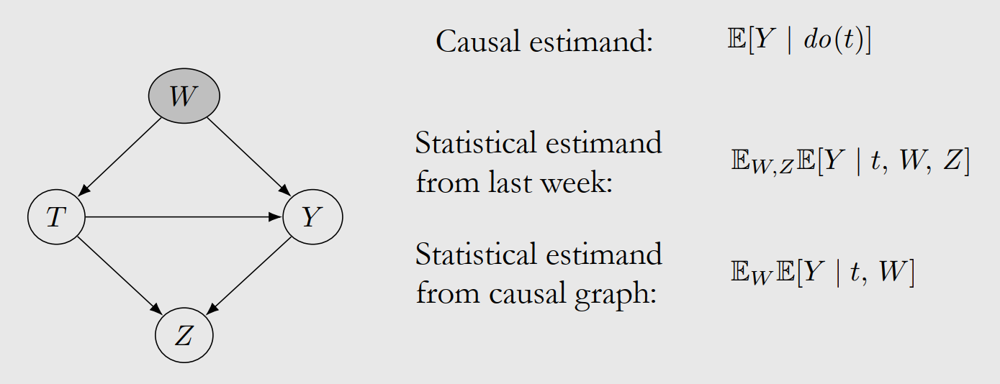

We do not condition on post-treatment covariates like Z because it would give us collider bias, we only condition on W. After estimation:

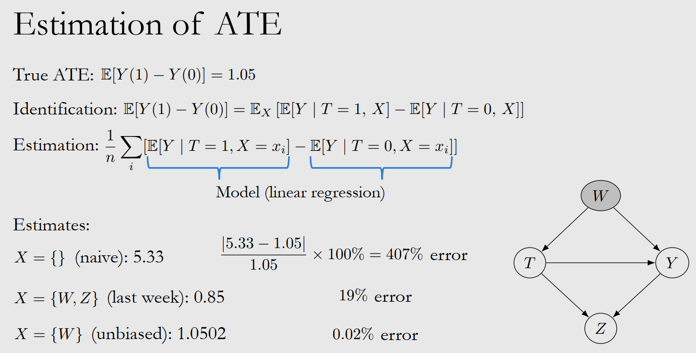

19% error comes from controlling for Z, which creates collider bias and brings the error up.

## 5 Randomized experiments and identification

### Randomized experiments

It is not possible to prove unconfoundedness or prove that the backdoor criterion has been satisfied, because there always could be an unobserved confounders. This is a problem always apparent in observational studies. With RTC, unconfoundedness is guaranteed. The groups in a situation can be made comparable. Some perspectives on RTCs:

1. Comparability and covariate balance
    * Treatment and control groups are the same in all aspects except treatment. The distribution of all their covariates are the same. Therefore, the difference in observed outcomes between these 2 groups must be because of the treatment. Covariate balance -> association = causation.
    * Covariate balance exists if the distribution of covariates X is the same across treatment groups. P(X | T=1) =(d) P(X | T=0). =(d) means distribution equality.
    * *Proof that randomization implies covariate balance*: T is not determined by X, T is independent of X. P(X | T=1) =(d) P(X) and P(X | T=0) =(d) P(X), therefore P(X | T=1) =(d) P(X | T=0)
    * *Proof that covariate balance implies association is causation*: 
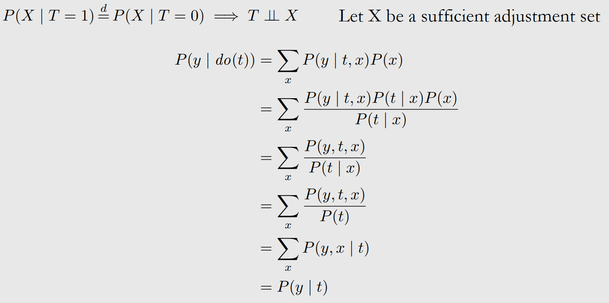

2. Exchangeability
    * It is not relevant which group gets the treatment and which doesn't, because groups are comparable. The assignation of treatment is exchangeable among the two groups. Randomization implies exchangeability.
3. No backdoor paths
    * In a graph with T, a confounder X and Y, T is decided randomly, not affected by X. There are therefore no backdoor paths, through X or any other unobserved variables either.

### Frontdoor adjustment

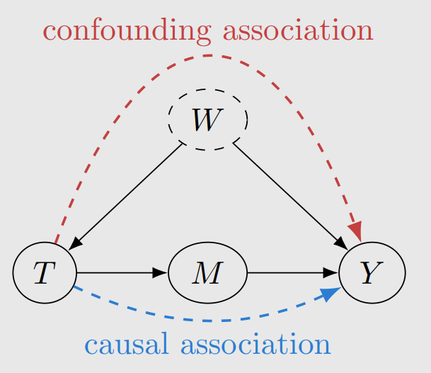

In a graph where there is an unobserved confounder, the backdoor path cannot be blocked. With he frontdoor adjustment, it is still possible to identify the causal effect of T on Y. All the causal association flows through M, so we can *focus* on M and isolate the causal association. 3 steps:

1. Identify the causal effect of T on M
    * P(m | do(t)) = P(m | t). because there is no backdoor path.
2. Identify the causal effect of M on Y
    * P(y | do(m)) = &sum;t P(y | m,t) P(t). There is a backdoor path (M -> T -> W -> Y), but we can block it by conditioning on T. Use T as a sufficient adjustment set and use the backdoor adjustment.
3. Combine the above steps to identify the causal effect of T on Y
    * **frontdoor adjustment formula**: P(y | do(t)) = &sum;m P(y | do(m)) P(m | do(t)) = &sum;m P(m | t) &sum;t' P(y | m,t') P(t')

A set of variables M satisfies the frontdoor criterion relative to T and Y if the following are true:

1. M completely mediates the effect of T on Y (all causal paths from T to Y go through M)
2. There is no unblocked backdoor path from T to M
3. All backdoor paths from M to Y are blocked by T

Proof of frontdoor adjustment using the truncated factorization in section 6.1. of the course book

### Pear's do-calculus

It neables the identification of identifiable causal quantities. P(Y \| do(T=t), X=x) where Y, T and X are arbitrary sets. There can be multiple treatments and/or multiple outcomes. Some notation for a causal graph G:

* GX is when all children of X are cut off
* GX(with a line over it) is when all parents of X are cut off
* GX(with a line over it)Z(with a line under it) is when all parents of X are cut off and Z's children are cut off

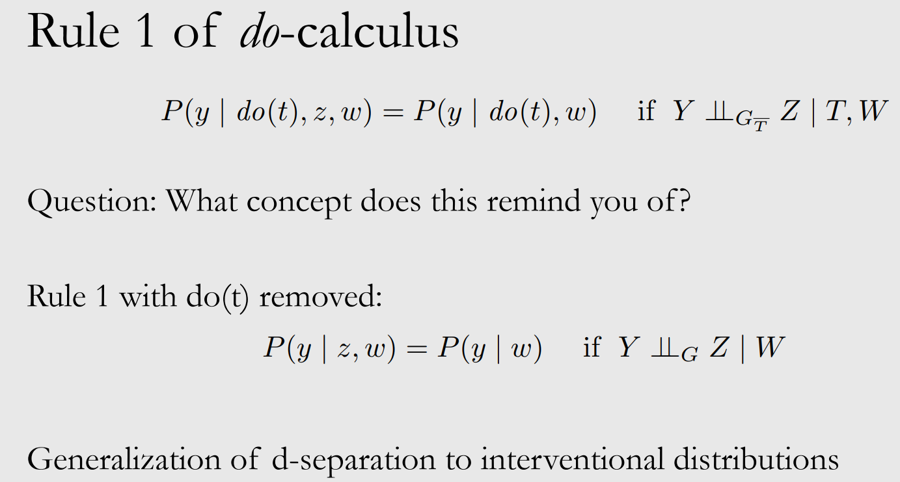

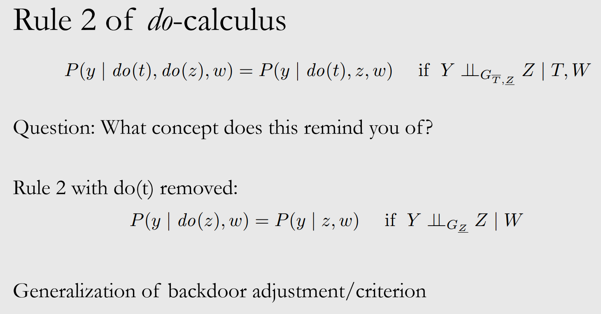

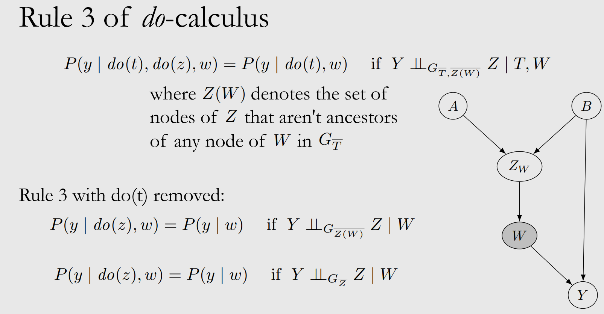

### Determining identifiability from a graph

See example in video or slides 35-40.

## 6 Estimation

Once we identify statistical estimands from a causal estimand, we can make an estimation, a number, from this statistical estimand.

### Conditional outcome modeling (COM)

Conditional ATE (CATE) = &tau;(x) = E[Y(1) - Y(0) | X=x]

We assume unconfoundedness and positivity, therefore &tau; = EW[E[Y|T=1, W] - E[Y|T=0, W]] = EW[&mu;(1,W) - &mu;(1,W)]. This is a statistical estimand, and &mu; is the conditional outcome model.

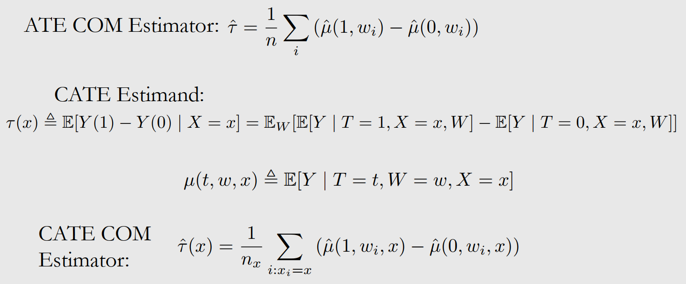

When dealing with high dimensions and many weights, the model might ignore *t* (treatment), it could assign it 0 weights. Because it is only one dimension. The estimates of ATE or CATE could be biased towards zero.

### Increasing data efficiency

How to ensure that the model doesn't ignore *t*? We can use grouped COM (GCOM) estimation, two models for each treatment. We don't need *t* as input anymore. In COM, the single model is trained with all the data. Now in GCOM, model for T=1 is fed treatment group data, and the model for T=0 is trained with control group data. The models can have **higher variance than what they would if they were trained with all the data**.

Alternative: TARNet hybrid architecture, all data is used for the model, W is the only input, and then the model breaks into 2 heads one for each treatment. Each head uses one part of the data, treatment data for T=1 and control data for T=0.

X-Learner (Künzel et al., 2019) does the following:

1. Make an estimation for T=1 and T=0 as a function of X, assuming X is a sufficient adjustment set and is all observed covariates
2. Impute ITEs (individual treatment effects). Compare the observed output and the model's estimation for the treatment group and for the control group. For the treatment group for example, ITE = Yi(1) - &mu;1(xi). We use the data from one outcome but all of the data from the treatment group.
3. Fit a model to predict ITE(1, i) from xi in treatment group, and fit a model to predict ITE(0, i) from xi in treatment group
4. Aggregate these two models with a weighting function.

### Propensity scores and IPW (inverse probability weighting)

The propensity for taking treatment, how likely you are to take treatment, is e(W) = P(T=1|W). Given positivity, unconfoundedness given W implies unconfoundedness given e(W). Even if W is high dimensional, e(W) is only a scalar. Instead of conditioning on W, we can condition on e(W) and reduce complexity.

See proof in slide 22 or in the course book in appendix A.2.

Propensity has an implication for the positivity-unconfoundedness tradeoff. Overlap decreases with the dimensionality of the adjustment set. The propensity score reduces the dimensionality of the adjustment set done to 1. Unfortunately, we don't have access to e(W). The best we can do is model it with logistic regression for instance.

Using e(W) instead of W doesn't solve positivity issues when W is high-dimensional.

> Pseudo-populations

We create pseudo-populations (reweighted populations) so that here, association is causation. We rewrite all examples by the IPW. See more about IPW in the course book in Appendix A.3

### Other methods

We can both model &mu;(t, w) and e(w). For example with *doubly robust methods*. See section 7.7 in the course book for other methods which include matching, double machine learning, causal trees and forests.

## 7 Unobserved confounding

Up until now, we have adjusted for confounders. But we can't adjust for unobserved confounders.

### Bounds

Having no unobserved confounding is unrealistic. The assumption of unconfoundedness is very strong, maybe we can make a weaker assumption that the ATE is inside an interval. We don't get the exact measure of the ATE, but only an interval.

#### No-assumptions bound

The outcome is bounded. For every t, a <= Y(t) <= b. ATE = E[Y(1) - Y(0)] is between (a-b) and (b-a), so it has a length limit of 2(b-a). With the no-assumptions bound, this can be cut in half. See more in slide 9 about the observational-counterfactual decomposition and how that means that this interval can be cut in half. To make it even slower, we can use the following techniques:

* **Monotone treatment response**
    - The assumption is that treatment always helps, that for every t, Yi(1) >= Yi(0). Every ITE is nonnegative, so the ATE is nonnegative.
* **Monotone treatment selection**
    - The assumption is that the potential outcomes of the treatment groups' are better than than the ones from the control group. E[Y(1)|T=1] >=E[Y(1)|T=0] and E[Y(0)|T=1] >=E[Y(0)|T=0]. The ATE is bounded from above by the associational difference: E[Y(1) - Y(0)] <= E[Y|T=1] - E[Y|T=0]
* **Optimal treatment selection**
    - The assumption is that individuals always receive the treatment group that is best for them.
    - If Ti=1, then Yi(1) >= Yi(0)
    - If Ti=0, then Yi(0) >= Yi(1)
    - E[Y(1)|T=0] <= E[Y|T=0] and E[Y(1)|T=0] <= E[Y|T=1]

### Sensitivity analysis

We cast our ATE estimate as a function of how strongly the confounders affect the treatment + how strongly the confounders affect the outcome. In this section, we still assume unconfoundedness, but we assume that this is based on W (observed confounder) and U (unobserved confounder).

* Linear single confounder
* Towards more gneral settings
