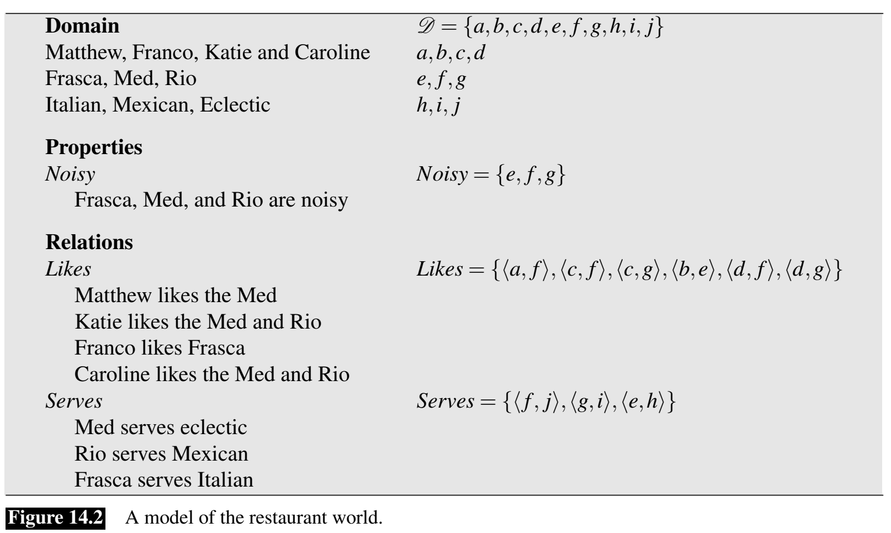
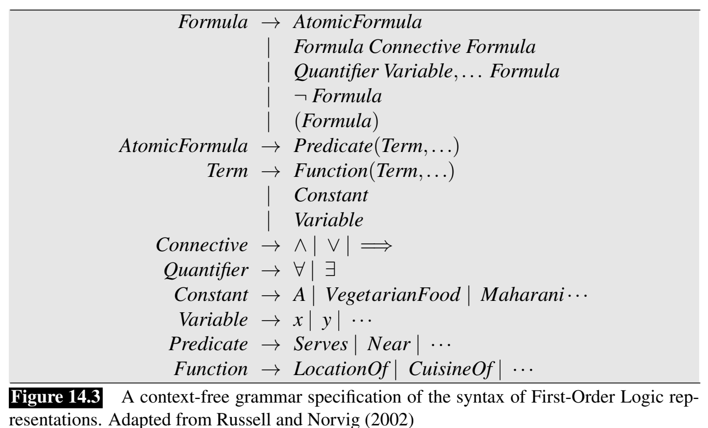
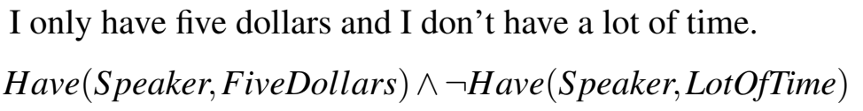
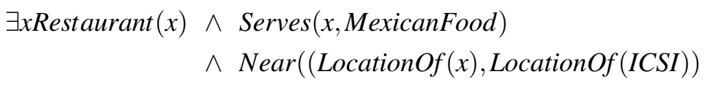

# 1. Model-Theoretic semantics

Model: formal construct that stands for the particular state of affairs in the world. Expressions in a meaning representation language can be mapped in a systematic way to the elements of the model.

The vocabulary of a meaning representations consists of two parts: the non-logical vocabulary and the logical vocabulary:

* Non-logical vocabulary: open-ended set of names for the objects, properties and relations that make up the world we're trying to represent. 
* Logical vocabulary: closed set of symbols/operators/quantifiers/links/... that provide the formal means for composing expressions in a given meaning representation language.

Each element of the non-logical vocabulary has a denotation in the model, every element of the non-logical vocabulary corresponds to a fixed, well-defined part of the model. The *domain* of a model is the set of objects that are part of the application being represented. Mary = WifeOf(Abe), MotherOf(Robert).

Properties can be captured in a model by denoting those domain elements that have the property in question; properties denote sets. Extensional approach: the denotation of properties like *red* is the set of things we think are red, the denotation of a relation like *married* is a set of pairs of domain elements that are married. Summarize:

* Objects denote elements of the domain
* Properties denote sets of elements of the domain
* Relations denote sets of tuples of elements of the domain

Interpretation: mapping from non-logical vocabulary of our meaning representation to the proper denotation in the model.

Restaurant example:

{width=500}

This scheme is not adequate, plausible meaning representations for these examples don't map directly to individual entities/properties/relation, they involve complications such as conjunctions, equality, quantified variables, negations. 

Using the word "and", we provide a truth-conditional semantics. a method for determining the truth of a complex expression from the meaning of the parts and the meaning of an operator by consulting a truth table. X & Y = 1 only if both are 1.

A context-free grammar specification of the syntax of First-Order Logic representations:

{width=500}

# 2. First-order logic (FOL)

flexible, well-understood, computationally tractable meaning representation language that satisfies many the desiderata. it makes very few commitments as to how things ought to be represented

## 2.1. Basic elements of first-order logic

Term: FOL device for representing objects. 3 ways to do this: constants, functions and variables.

* Constants: specific objects, single capitalized letters (A,B) or single capitalized words reminiscent of proper nouns (Maharani, Harry). Constants refer to exactly one object. Objects can have multiple constants refer to them
* Functions: genitives. Frasca's location -> LocationOf(Frasca). FOL functions are syntactically equal to single argument predicates, but FOL functions are terms in that they refer to unique objects.
* Variables: single lower-case letters, allow to make assertions and draw inferences about objects without having to make reference to any particular named object. 
    - we can make statements about a particular unknown object 
    - we can make statements about all the objects in some arbitrary world of objects

An example like Maharani serves vegetarian food can be used with following formula: Serves(Maharani, VegetarianFood). Maharani is a restaurant --> Restaurant(Maharani). Logical connectives:

{width=500}

Quantifiers: E (flipped horizontally): there exists, A (flipped vertically): for all.

A restaurant that serves Mexican food near ICSI

{width=500}

All vegetarian restaurants serve vegetarian food

{width=500}